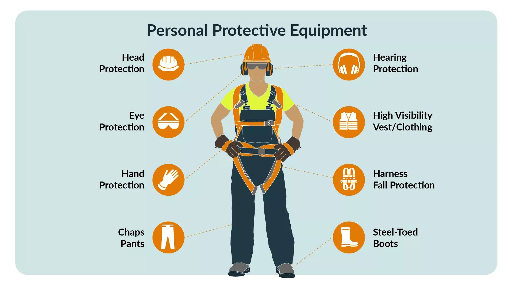
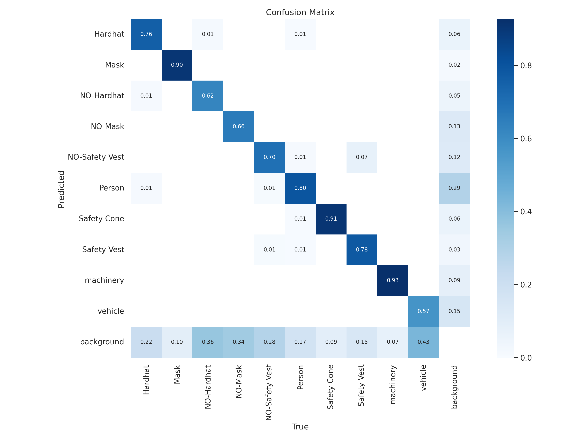
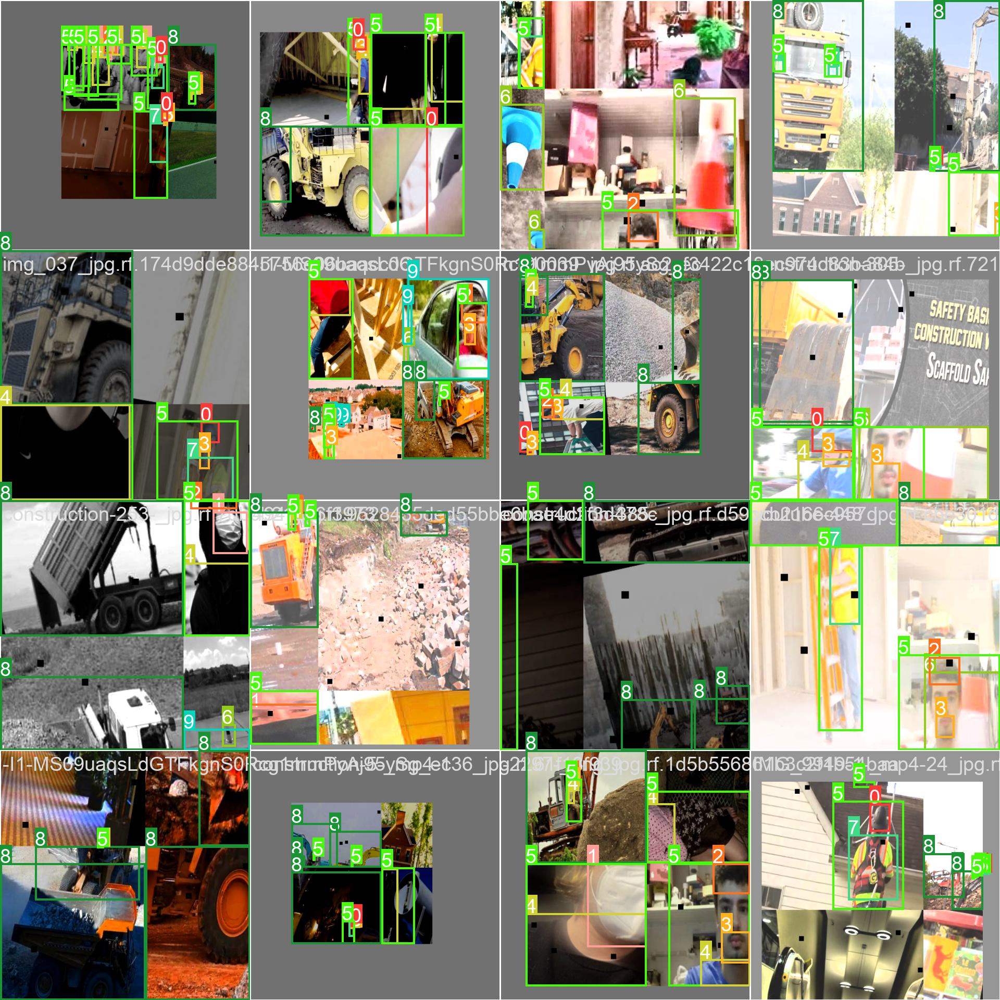
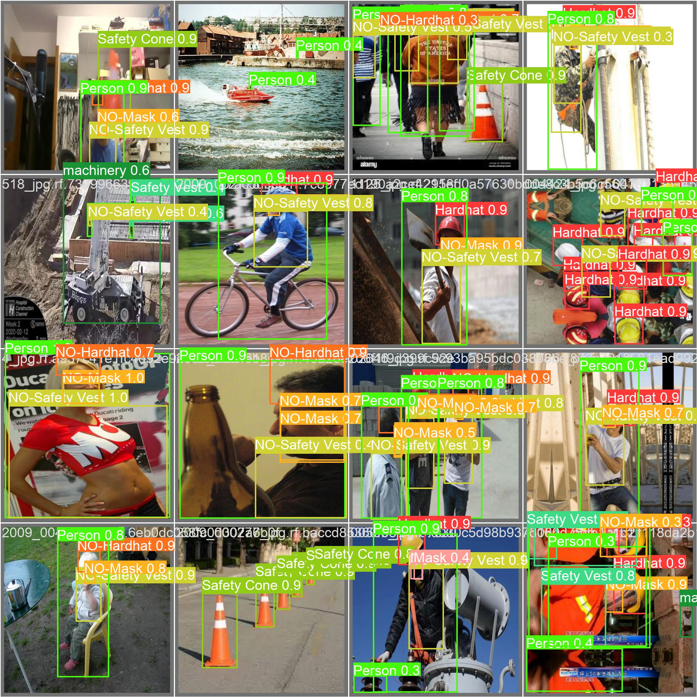
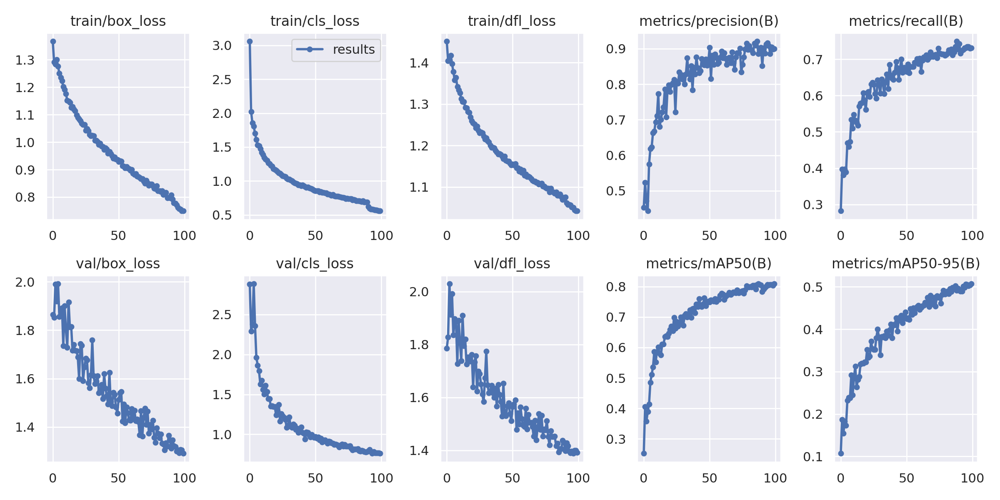
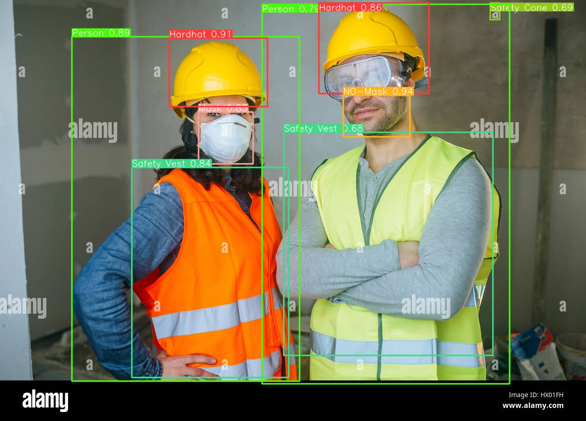

# SafeSite AI: PPE Detection for Construction Site Safety using YOLOv8


> **4,764 workers died on the job in 2020** (3.4 per 100,000 full-time equivalent workers). Workers in transportation, material moving, and construction occupations accounted for nearly half of all fatal occupational injuries (47.4%), with **1,282** and **976** workplace deaths, respectively.
>
> *Occupational Safety and Health Administration (US Department of Labour)*

---

## 🚧 Introduction

Construction sites are hazardous environments, often leading to accidents due to the absence of proper safety equipment. **SafeSite AI** is an AI-powered solution that detects Personal Protective Equipment (PPE) compliance among workers. This project leverages **YOLOv8** for real-time object detection and can be further extended to track workers and trigger alerts for safety monitoring.

We used the dataset provided by Roboflow on the [**Construction Site Safety Image Dataset**](https://universe.roboflow.com/roboflow-universe-projects/construction-site-safety).

For easy access, the dataset is also available on [**Kaggle**](https://www.kaggle.com/datasets/snehilsanyal/construction-site-safety-image-dataset-roboflow).

The dataset consists of **2,801** labeled images in YOLOv8 format, split into:
- **Training:** 2,605 images
- **Validation:** 114 images
- **Testing:** 82 images

### 🏗️ Objects Detected (10 Classes):
- **Hardhat**, **Mask**, **NO-Hardhat**, **NO-Mask**, **NO-Safety Vest**, **Person**, **Safety Cone**, **Safety Vest**, **Machinery**, **Vehicle**



---

## ⚙️ Setup

The model was trained and tested on **Kaggle** using an **NVIDIA P100 GPU**. We utilized the `ultralytics` library from [**Ultralytics**](https://docs.ultralytics.com) to implement YOLOv8 custom object detection.

To set up the project locally:

```bash
# Clone the repository
git clone https://github.com/your-repo/SafeSiteAI.git
cd SafeSiteAI

# Install dependencies
pip install ultralytics opencv-python numpy matplotlib

# Run the detection script
python detect.py --weights models/best.pt --source source_files/demo_video.mp4
```

For more details, check out this [**notebook**](https://www.kaggle.com/code/snehilsanyal/check-yo-self-before-you-wreck-yo-self-css-eda).

---

## 📁 File Hierarchy

```
├───assets
├───data
│   ├───data.yaml
│   ├───ppe_data.yaml
│   ├───train
│   │   ├───images
│   │   └───labels
│   ├───valid
│   │   ├───images
│   │   └───labels
│   └───test
│       ├───images
│       └───labels
├───models
│   ├───yolov8n.pt  # Pre-trained model
│   ├───best.pt     # Custom trained model
├───output
│   └───output_yolov8n_100e
├───results
│   ├───confusion_matrix.png
│   ├───train_batch14672.jpg
│   ├───val_batch2_pred.jpg
│   ├───results.png
├───source_files
│   ├───videos
│   ├───images
└───README.md
```

---

## 📊 Results

The model was trained for **100 epochs**, completing in **2.719 hours**. The following images showcase the model’s performance:









---

## 🎯 Outputs

Here are some sample detections from the trained model:





---

## 🚀 Future Work

🔹 Train the model for additional epochs to improve accuracy.  
🔹 Compare results with four other YOLOv8 models.  
🔹 Implement worker **ID tracking** and store bounding boxes for those not wearing PPE.  
🔹 Deploy an **ML-powered safety alert system** with real-time monitoring.

---

## 🎬 Demo Video

To see **SafeSite AI** in action, check out the demo video available in the repository:

[](source_files/videos/demo_video.mp4)

---

### 📩 Contact
For inquiries, improvements, or collaborations, feel free to reach out!

📧 Email: **shaishavsurati06@gmail.com**  
🔗 GitHub: [**shaishav06 GitHub Profile**](https://github.com/shaishav06)  
🌐 Website: [**My Website**](https://chaitanyaai.in/)
---
 Linkedin: [**Shaishav Surati**](https://www.linkedin.com/in/shaishavsurati/)
